# SpreadIt

### Introduction

Welcome to SpreadIt, a cutting-edge social news aggregation platform that seamlessly blends cutting-edge backend technologies with a user-friendly interface to revolutionize the way you consume and share news. Powered by a robust stack of modern web development frameworks, including TypeScript, React, Next.js, and PostgreSQL, SpreadIt offers a scalable and efficient infrastructure for facilitating seamless content submission, sharing, and voting across various formats, including articles, images, and videos.

## Table of Contents

- [Overview](#overview)
- [Features](#features)
- [Demo](#demo)
- [Tech Stack](#tech-stack)
- [Installation](#installation)
- [Usage](#usage)
- [Environment Variables](#environment-variables)
- [Contributing](#contributing)
- [License](#license)

## Overview

SpreadIt is designed to offer users a smooth experience for discovering, sharing, and engaging with diverse content types. It facilitates content submission, voting, and sharing through an intuitive and responsive interface. The platform aims to foster a vibrant community-driven ecosystem.

## Features

- **Content Submission:** Users can submit articles, images, and videos effortlessly.
- **Voting System:** Enables users to vote on submitted content.
- **Seamless Sharing:** Facilitates easy sharing of content across various platforms.
- **Modern Interface:** User-friendly and responsive design for an enhanced browsing experience.
- **Authentication & Authorization:** Utilizes NextAuth and OAuth2 for secure user authentication.
- **Scalable Architecture:** Employs scalable backend technologies for efficient handling of data.
- **Optimistic Updates:** Provides a smooth and responsive interface using optimistic updates.
- **Infinite Scroll:** Implements infinite scroll for seamless content browsing.
- **Real-time Updates:** Utilizes Redis and Upstash Redis for real-time data updates.
- **Data Validation:** Implements Zod for robust data validation.
- **Styling:** Utilizes TailwindCSS and Shadcn-ui for a sleek and customizable UI.

## Demo

> Sign In
> 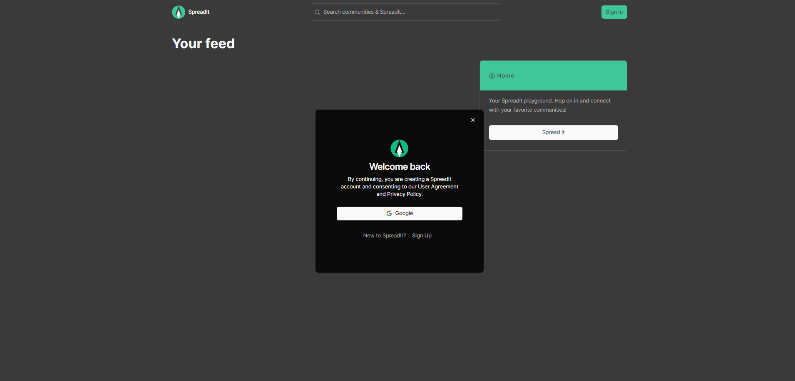
> Sign Up
> 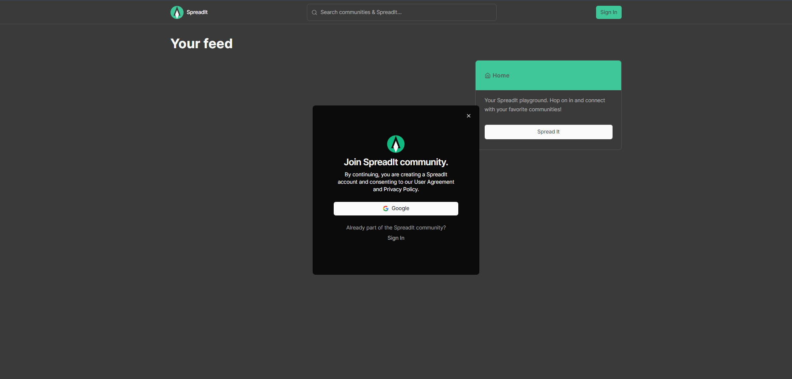
> Feed
> 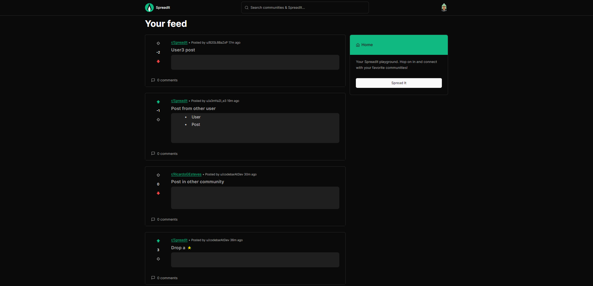
> Create Community
> 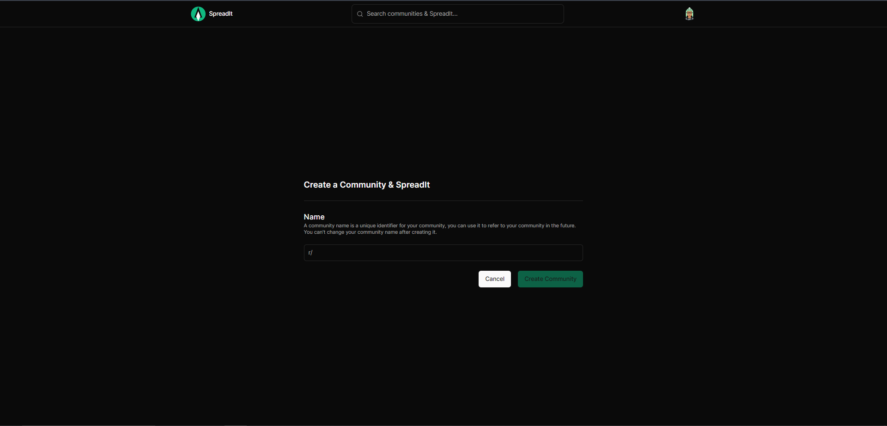
> Create Post
> 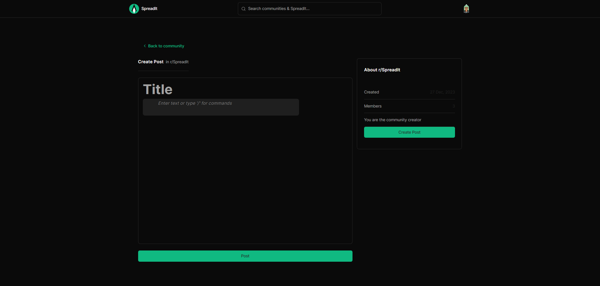
> Rich Text Editor
> 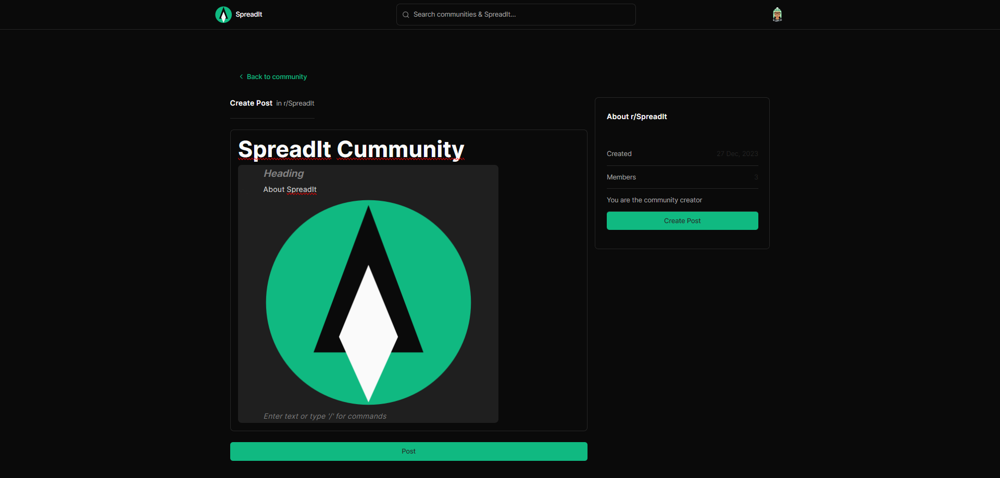
> Single Post View
> 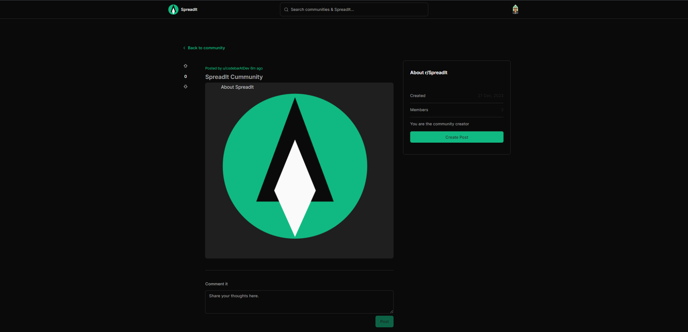
> Reply Post
> 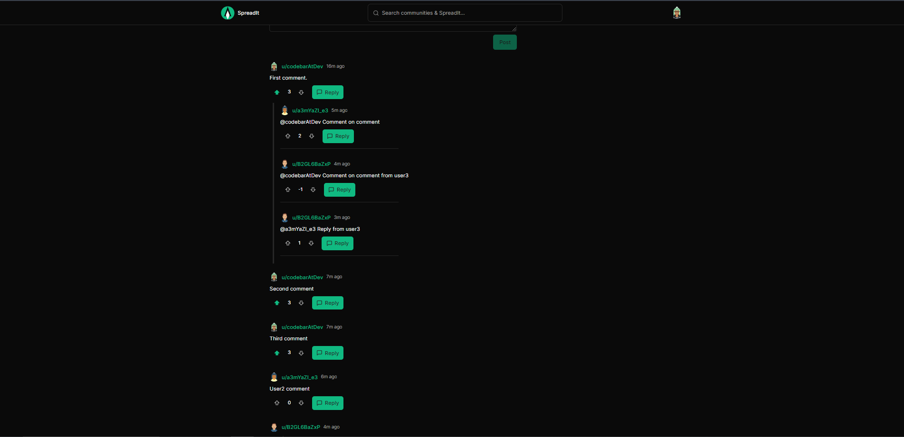
> Settings
> 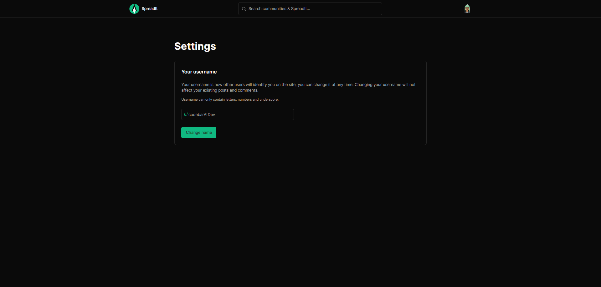
> Search
> 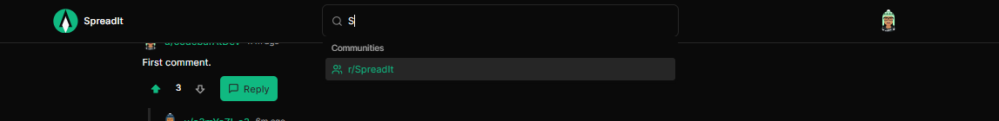
> Dropdown Navigation
> 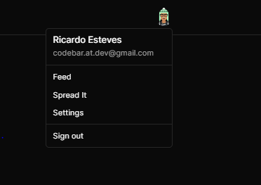

## Tech Stack

- TypeScript
- React
- Next.js
- PostgreSQL
- Supabase
- Redis & Upstash Redis
- Tanstack/react-query
- Prisma
- NextAuth & OAuth2
- Axios
- Zod
- UploadThing
- TailwindCSS
- Shadcn-ui
- BlockNote

SpreadIt's robust technological stack ensures the platform's scalability, reliability, and efficiency:

- **TypeScript:** We leverage TypeScript for its type safety, enabling robust code development and preventing runtime errors.

- **React:** Utilizing React, we create interactive and dynamic user interfaces that enhance the user experience.

- **Next.js:** Next.js powers the server-side rendering capabilities of SpreadIt, optimizing performance and enhancing SEO.

- **PostgreSQL:** PostgreSQL serves as our relational database, providing a powerful and reliable foundation for managing content and user data.

- **Supabase:** Supabase acts as our backend infrastructure, simplifying database management and authentication processes.

- **Redis:** Redis, deployed on Upstash, handles caching and data retrieval, ensuring rapid content delivery and improved user experience.

- **Tanstack/react-query:** react-query enables efficient data fetching and caching, ensuring smooth user interactions.

- **Infinite scroll:** Infinite scroll provides a continuous and seamless user experience, allowing you to browse endless content without page reloads.

- **Optimistic updates:** Optimistic updates deliver real-time feedback to users, keeping them informed of content changes and interactions.

- **Prisma:** Prisma simplifies data access and management, providing an abstraction layer for interacting with the database.

- **NextAuth:** NextAuth handles user authentication, ensuring secure and seamless user logins and registrations.

- **OAuth2:** OAuth2 enables authentication with various social media platforms, providing users with convenient sign-in options.

- **Axios:** Axios facilitates HTTP requests, enabling communication with external APIs.

- **Zod:** Zod provides type validation for API requests and responses, ensuring data integrity.

- **UploadThing:** UploadThing streamlines file uploading, making it easy for users to share multimedia content.

- **TailwindCSS:** TailwindCSS powers our responsive and stylish user interface, enhancing visual appeal and user experience.

- **Shadcn-ui:** Shadcn-ui provides a collection of React components for building modern and accessible user interfaces.

- **BlockNote:** BlockNote enables users to create and edit rich text content, facilitating engaging and informative posts.

## Installation

To run SpreadIt locally, follow these steps:

1. Install dependencies: `npm install`
2. Set up environment variables.
3. Run the application: `npm run dev`
4. Access the application at `http://localhost:3000`
5. Don't forget to set up the database schema using Prisma Migrate, and seed the database using Prisma Studio. prisma generate and prisma db push.

## Usage

Once the application is running locally, access it through the browser and explore its features. You can submit content, vote, share, and experience the seamless user interface.

## Environment Variables

SpreadIt requires the following environment variables to be set. Create a `.env` file in the root directory and add the following variables:

```plaintext
DATABASE_URL=
NEXTAUTH_SECRET=
NEXTAUTH_URL=
GOOGLE_CLIENT_ID=
GOOGLE_CLIENT_SECRET=
UPLOADTHING_SECRET=
UPLOADTHING_APP_ID=
REDIS_URL=
REDIS_SECRET=
```

> **Note:** The `DATABASE_URL` variable should be set to the URL of your PostgreSQL database. The `NEXTAUTH_SECRET` variable should be set to the Auth secret as a string. The `NEXTAUTH_URL` variable should be set to the URL of your application. The `GOOGLE_CLIENT_ID` and `GOOGLE_CLIENT_SECRET` variables should be set to the client ID and client secret of your Google OAuth2 application. The `UPLOADTHING_SECRET` variable should be set to the Uploadthing Api Secret as a string. The `UPLOADTHING_APP_ID` variable should be set to the ID of your UploadThing application. The `REDIS_URL` variable should be set to the URL of your Redis database. The `REDIS_SECRET` variable should be set to Redis Api Secret as a string.

> Make sure to provide the appropriate values for each variable.

## Contributing

Contributions are welcome! If you'd like to contribute to SpreadIt, please fork the repository, create a new branch, make your changes, and submit a pull request. Be sure to follow the contribution guidelines.

## License

This project is licensed under the [MIT License](LICENSE).
